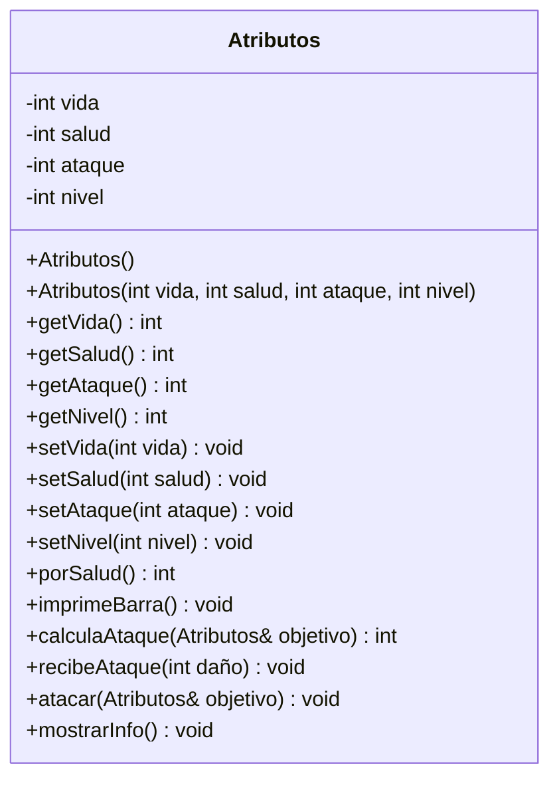

```mermaid
classDiagram
class Atributos {
    -int vida
    -int salud
    -int ataque
    -int nivel

    +Atributos()
    +Atributos(int vida, int salud, int ataque, int nivel)
    +getVida() int
    +getSalud() int
    +getAtaque() int
    +getNivel() int
    +setVida(int vida) void
    +setSalud(int salud) void
    +setAtaque(int ataque) void
    +setNivel(int nivel) void
    +porSalud() int
    +imprimeBarra() void
    +calculaAtaque(Atributos& objetivo) int
    +recibeAtaque(int daño) void
    +atacar(Atributos& objetivo) void
    +mostrarInfo() void
}
```