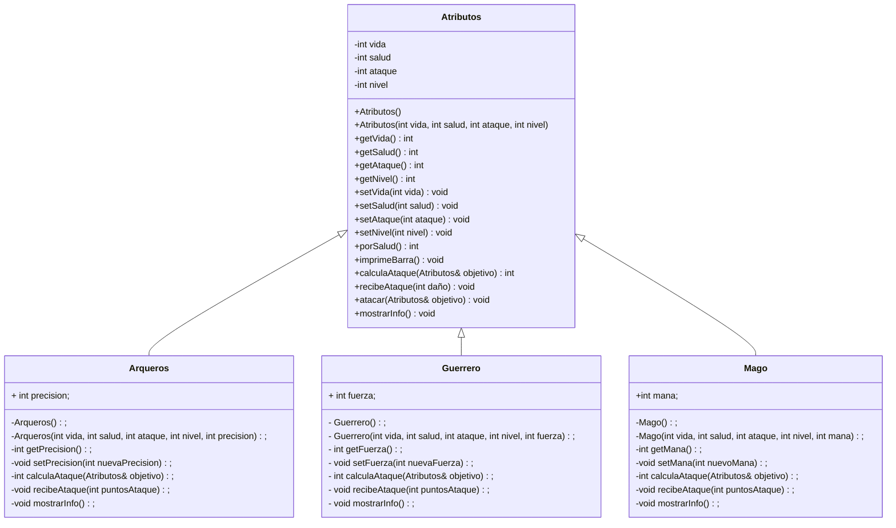

```mermaid
classDiagram
        Atributos<|--Arqueros
        Atributos<|--Guerrero
        Atributos<|--Mago
            class Atributos {
                -int vida
                -int salud
                -int ataque
                -int nivel

                +Atributos()
                +Atributos(int vida, int salud, int ataque, int nivel)
                +getVida() int
                +getSalud() int
                +getAtaque() int
                +getNivel() int
                +setVida(int vida) void
                +setSalud(int salud) void
                +setAtaque(int ataque) void
                +setNivel(int nivel) void
                +porSalud() int
                +imprimeBarra() void
                +calculaAtaque(Atributos& objetivo) int
                +recibeAtaque(int daño) void
                +atacar(Atributos& objetivo) void
                +mostrarInfo() void
            }
        class Guerrero {
            -  Guerrero();
            -   Guerrero(int vida, int salud, int ataque, int nivel, int fuerza);
            -  int getFuerza();
            -  void setFuerza(int nuevaFuerza);
            -  int calculaAtaque(Atributos& objetivo);
            -  void recibeAtaque(int puntosAtaque);
            -  void mostrarInfo();

            + int fuerza;
        }
        class Arqueros {
            -Arqueros();
            -Arqueros(int vida, int salud, int ataque, int nivel, int precision);
            -int getPrecision();
            -void setPrecision(int nuevaPrecision);
            -int calculaAtaque(Atributos& objetivo);
            -void recibeAtaque(int puntosAtaque);
            -void mostrarInfo();

            + int precision;
        }
        class Mago {
            -Mago();
            -Mago(int vida, int salud, int ataque, int nivel, int mana);
            -int getMana();
            -void setMana(int nuevoMana);
            -int calculaAtaque(Atributos& objetivo);
            -void recibeAtaque(int puntosAtaque);
            -void mostrarInfo();

            +int mana;
        }
```